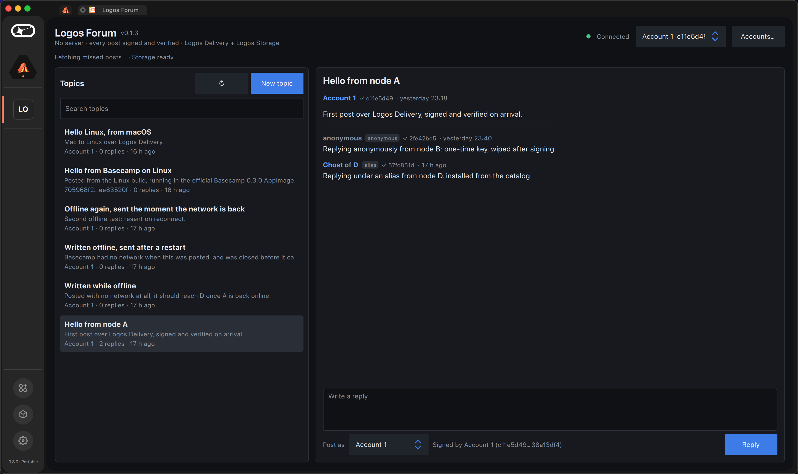
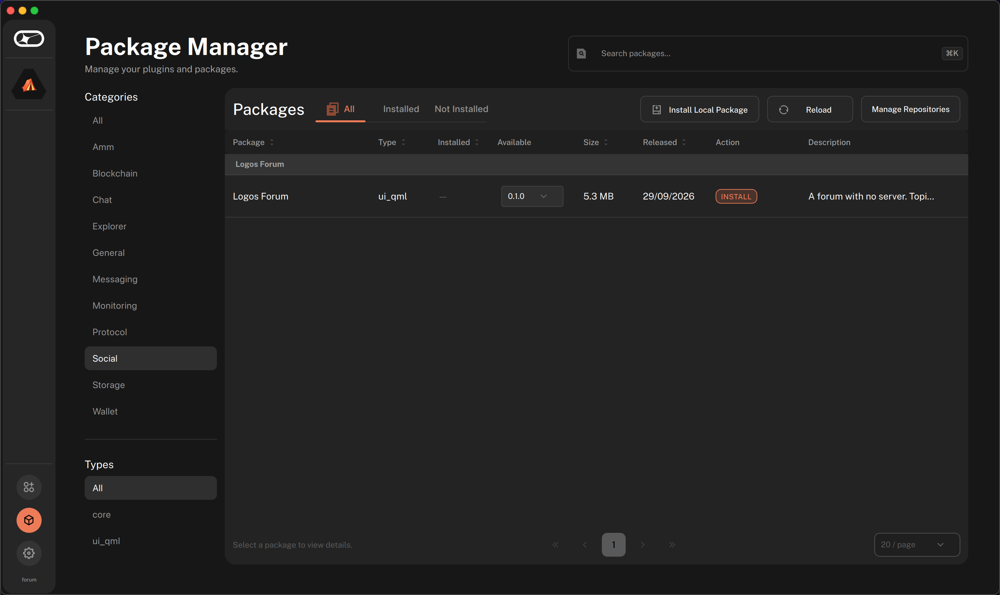

# Logos Forum (LP-0026)

A forum for Logos Basecamp with no server anywhere: topics and replies travel
over **Logos Delivery**, history is kept locally and on **Logos Storage**, and
every post is signed and checked on arrival. You post as yourself, under an
alias, or as no one at all.

> **Status:** the forum runs in **Logos Basecamp 0.3.0** (macOS and Linux) and has been tested
> end to end between two real nodes on the logos.test network
> ([`docs/e2e.md`](docs/e2e.md)). The core has 25 tests of its own.



## What makes it different

- **Authors are verified, not claimed.** Every post is Ed25519-signed and the
  signature is checked against the key the post names before it is shown. A
  post that was edited in transit, or that claims someone else's key, is
  dropped. Post ids are the SHA-256 of the signed bytes, so a post is
  tamper-evident and any copy of it is recognised as the same post.
- **Three ways to sign, chosen per post.**
  - *Identity*: one of your accounts; your posts link to each other.
  - *Alias*: the same account under a name you choose for the post.
  - *Anonymous*: a key made for that one post and wiped immediately, so two
    anonymous posts cannot be linked to each other or to you.
- **Identity rotation.** An account can switch to a fresh key after a number
  of posts or a period of time; nothing links the old key to the new one.
- **Nothing you write is lost.** A post is stored the moment you press Post and
  queued; if the network is down it is retried with back-off until it goes.
- **Coming back online catches up, even on a network that keeps nothing.**
  A returning node asks the network's store nodes, and it asks the forum: a
  peer holding more posts answers with a snapshot on **Logos Storage**, names
  its storage node so it can be dialled directly, and every post in the
  snapshot is checked like a live one. On logos.test today the store nodes
  keep no archive at all (measured, see [`docs/e2e.md`](docs/e2e.md)), so this
  is the path that actually works. Duplicates are impossible because ids are
  content.
- **It does not flood the network.** Sends are paced by a token bucket.

## LP-0026 criteria

| Criterion | Where |
|---|---|
| One or more accounts to post from | `core/include/forum/identity.h`: accounts, selected per post |
| Create topics and reply | `Engine::post_topic`, `Engine::post_reply` |
| Reply by id, by alias, or revealing no id | `Mode::Identity`, `Mode::Alias`, `Mode::Anonymous` |
| Privacy of a long-lived identity; rotation | `RotationPolicy`, `rotate()`; per-post anonymous keys |
| No centralised server or service | Logos Delivery for posts, Logos Storage for history, SQLite on the device |
| If offline when a message arrived, obtain past messages | store query, then `Engine::request_history` → a peer's snapshot on Logos Storage (`import_snapshot`); tested between two nodes |
| If a send fails, the text stays locally to retry | the outbox, `Store::failed` + `backoff_ms` |
| Does not flood the network | `RateLimiter` |
| Basecamp app, loadable, in a module catalog | loads in Basecamp 0.3.0; served by [`logos-forum-catalog`](https://github.com/edenbd1/logos-forum-catalog), installed from it on a blank Basecamp |
| Video demo, FURPS self-assessment | *at submission* |

## Install in Basecamp

**From the catalog** (Basecamp 0.3.0, macOS Apple silicon or Linux x86_64): *Settings → Package Repositories → Add
a repository*, paste
`https://raw.githubusercontent.com/edenbd1/logos-forum-catalog/main/logos-repo.json`,
then *Package Manager → Social → Logos Forum → Install*. Basecamp installs
`delivery_module` and `storage_module` from the official catalog with it.



**From source.** Build the package (needs [Nix](https://nixos.org)):

```bash
nix build .#lgx-portable     # result/logos-logos_forum-module.lgx
```

The forum needs `delivery_module` 0.2.1 and `storage_module` 2.1.2, both in
the official Logos catalog. Install everything into a Basecamp user
directory and open Basecamp on it:

```bash
scripts/install-local.sh ~/basecamp-forum result/*.lgx delivery_module-0.2.1.lgx storage_module-2.1.2.lgx
LogosBasecamp --user-dir ~/basecamp-forum
```

## Using the forum

**Your first minute.** Open *Logos Forum* in Basecamp's sidebar. An account
("Account 1") is created on first launch, so you can post straight away. The
header shows the network state (*Connected*, or *Joined, waiting for peers*)
and, under it, the history state: when the forum last caught up, and whether
Logos Storage is ready.

**Read.** The left column lists topics, most recently active first, with a
line of their text, their author and reply count; a blue dot marks activity
since you last opened a topic, and the search box filters by title, text or
author. Click one to open it; replies follow in order.
Every author line carries a ✓ and the first bytes of the key the post's
signature was checked against; hover it for the full key. A post whose
signature does not check is never shown.

**Post.** *New topic* opens the composer: a title, a body, and *Post as*.
Reply from the box under an open topic.

| Post as | What others see | What it links |
|---|---|---|
| *your account* | the account's key (or its label, on your own machine) | all posts by that account |
| *alias* | the name you type, marked **alias** | posts by the same account, to anyone comparing keys |
| *anonymous* | "anonymous", marked **anonymous**, under a key made for that post and wiped | nothing: two anonymous posts share no key |

**Accounts** (*Accounts…*): create several and switch between them; the one
selected signs what you post next. **Identity rotation** replaces the selected
account's key with a fresh one, now or automatically after a number of posts
or days. Nothing links the old key to the new one.

**Offline.** Write as usual: the post appears at once, marked *sending…*,
then *waiting for the network, will retry*, and the header counts what is
waiting. A post leaves that state only when the network confirms it has it:
Logos Delivery accepts a send even with no peers and retries it only in
memory, so the forum keeps the post itself and sends it again as soon as the
connection returns, or after two minutes without confirmation, or with
back-off (2 s … 5 min) after an error. This holds even after Basecamp was closed.
When you come back after
being away, the forum fetches what you missed from the network and from peers'
snapshots on Logos Storage; *Accounts… → Fetch missed posts* does it on demand,
and *Save snapshot to Logos Storage* publishes yours for others.

**Errors** are shown in one line under the header: a refused post (too long,
no title), a send the network gave up on (it is retried), a storage node that
is not ready.

## Test between two real nodes

```bash
scripts/e2e-two-nodes.sh result/*.lgx delivery_module-0.2.1.lgx storage_module-2.1.2.lgx
```

Starts two Basecamp instances on logos.test, drives the forum's own interface
and checks each node's store: a topic from A reaches B with the same author
key; B's anonymous reply reaches A under a key none of B's accounts hold; and
B, wiped to a fresh install, recovers both posts from A's snapshot on Logos
Storage. Output of a run: [`docs/e2e/e2e-two-nodes.out`](docs/e2e/e2e-two-nodes.out).

## Build and test the core

Needs a C++20 compiler, CMake, libsodium, SQLite and nlohmann-json
(`brew install libsodium sqlite nlohmann-json` on macOS).

```bash
cmake -S core -B build -DCMAKE_BUILD_TYPE=Release
cmake --build build -j
./build/forum_core_tests
```

## Credits

The module wiring follows the reference
[`jzaki/forum-sample-app`](https://github.com/jzaki/forum-sample-app) that the
prize lists as a resource. The forum core here is written from scratch.

## Licence

MIT OR Apache-2.0.
