<p align="center">
  
</p>

<h1 align="center">Logos Forum</h1>

<p align="center"><b>A forum with no server, inside Logos Basecamp. Every post signed, every author verified.</b></p>

<p align="center">
A community-built <a href="https://github.com/logos-co/logos-basecamp">Logos Basecamp</a> module for <a href="https://github.com/logos-co/lambda-prize/blob/master/prizes/LP-0026.md">λPrize LP-0026</a>.
Topics and replies travel peer to peer over <b>Logos Messaging</b>, each device keeps the history and shares it with newcomers,
and every post is checked by the app itself on arrival.
</p>

<p align="center">
  
  
  
  <a href="https://github.com/edenbd1/logos-forum-catalog"></a>
  
</p>

[](https://youtu.be/xNY5EzhCtuI)

**▶ [Watch the 3-minute demo](https://youtu.be/xNY5EzhCtuI)**: install, two live nodes, alias, anonymous, key rotation, offline, a newcomer getting the history.

> **Status:** the forum runs in **Logos Basecamp 0.3.0** (macOS and Linux) and is
> installable from its [catalog](#install-in-basecamp). It has been tested end to
> end on five real nodes, 24 checks, on logos.test and again on logos.dev
> ([`docs/e2e.md`](docs/e2e.md)); the core has 47 tests of its own; CI is green
> on Linux and macOS, and builds the Windows x86_64 package (a mingw cross
> build, not yet run in Basecamp on Windows; the official catalog has no Windows
> build of `liblogos_lez_rln_module` or `libp2p_module`, so `logos.test` with RLN
> is macOS and Linux only). It runs on `logos.dev`, which needs no RLN, so anyone
> can post with nothing to set up, and a newcomer gets the whole history from
> the network's store nodes even when nobody else is online
> ([run](docs/e2e/e2e-history-offline-0.3.2.out)). Support for `logos.test`
> with RLN, the membership paid by a sponsor, is built and opt-in
> ([logos.test, RLN and the sponsor](#logostest-rln-and-the-sponsor)).

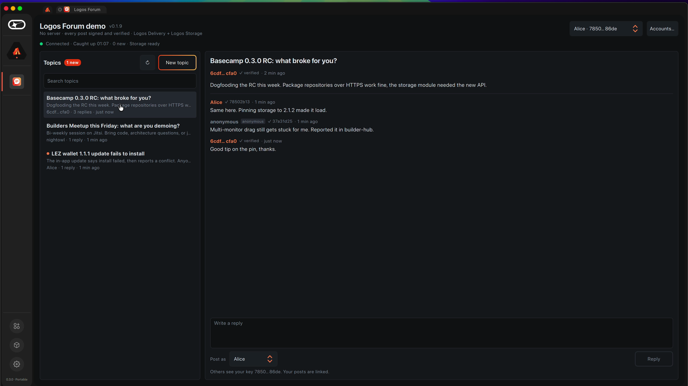

## What makes it different

- **Authors are verified, not claimed.** Every post is Ed25519-signed and the
  signature is checked against the key the post names before it is shown. A
  post that was edited in transit, or that claims someone else's key, is
  dropped. Post ids are the SHA-256 of the signed bytes, so a post is
  tamper-evident and any copy of it is recognised as the same post.
- **Three ways to sign, chosen per post.**
  - *Identity*: one of your accounts; your posts link to each other.
  - *Alias*: the same account under a name you choose for the post.
  - *Anonymous*: a key made for that one post and wiped immediately, so two
    anonymous posts cannot be linked to each other or to you.
- **Identity rotation.** An account can switch to a fresh key after a number
  of posts or a period of time; nothing links the old key to the new one.
- **Nothing you write is lost.** A post is stored the moment you press Post and
  queued; if the network is down it is retried with back-off until it goes.
- **Coming back online catches up, even on a network that keeps nothing.**
  A returning node asks the network's store nodes, and it asks the forum: a
  peer holding more posts sends the most recent ones as bundles over **Logos
  Delivery**, through the relays, so neither side learns the other's address,
  and every post is checked like a live one. On logos.test today the store
  nodes keep no archive at all (measured, see [`docs/e2e.md`](docs/e2e.md)), so
  this is the path that actually works. A node can also opt in to fetching a
  peer's full snapshot from **Logos Storage**, at the cost of connecting to that
  peer. Duplicates are impossible because ids are content.
- **It does not flood the network.** Sends are paced by a token bucket, and
  history answers are capped and paced too.
- **Unsigned traffic cannot steer it.** Titles and names from other people are
  shown as plain text, what a stranger's request can make a node send is
  capped per hour, nothing makes the forum connect to an address a stranger
  chose, and posts dated in the future are refused. See [`docs/security.md`](docs/security.md), written after
  an [external review](https://github.com/edenbd1/lp-0026-forum/issues/1).

## LP-0026 criteria

| Criterion | Where |
|---|---|
| One or more accounts to post from | `core/include/forum/identity.h`: accounts, selected per post |
| Create topics and reply | `Engine::post_topic`, `Engine::post_reply` |
| Reply by id, by alias, or revealing no id | `Mode::Identity`, `Mode::Alias`, `Mode::Anonymous` |
| Privacy of a long-lived identity; rotation | `RotationPolicy`, `rotate()`; per-post anonymous keys |
| No centralised server or service | Logos Delivery for posts, Logos Storage for history, SQLite on the device |
| If offline when a message arrived, obtain past messages | store query, then `Engine::request_history` → peers' bundles over Delivery, or (opt-in) a peer's snapshot on Logos Storage (`import_snapshot`); tested on five nodes |
| If a send fails, the text stays locally to retry | the outbox, `Store::failed` + `backoff_ms` |
| Does not flood the network | `RateLimiter` |
| Basecamp app, loadable, in a module catalog | loads in Basecamp 0.3.0; served by [`logos-forum-catalog`](https://github.com/edenbd1/logos-forum-catalog), installed from it on a blank Basecamp |
| Video demo, FURPS self-assessment | [video](https://youtu.be/xNY5EzhCtuI), [solution file](submission/LP-0026.md) |

## Install in Basecamp

**From the catalog** (Basecamp 0.3.0, macOS Apple silicon, Linux x86_64 or Windows x86_64): *Settings → Package Repositories → Add
a repository*, paste
`https://raw.githubusercontent.com/edenbd1/logos-forum-catalog/main/logos-repo.json`,
then *Package Manager → Social → Logos Forum → Install*. Basecamp installs
what the forum needs with it: `delivery_module` and `storage_module`, and for
logos.test the RLN modules and `libp2p_module`, from the official catalog, and
`rln_gifter_module` from the forum's catalog. Nothing else to do: no token, no
wallet, no account to fund.

1. **Add the repository** in *Settings → Package Repositories*:

   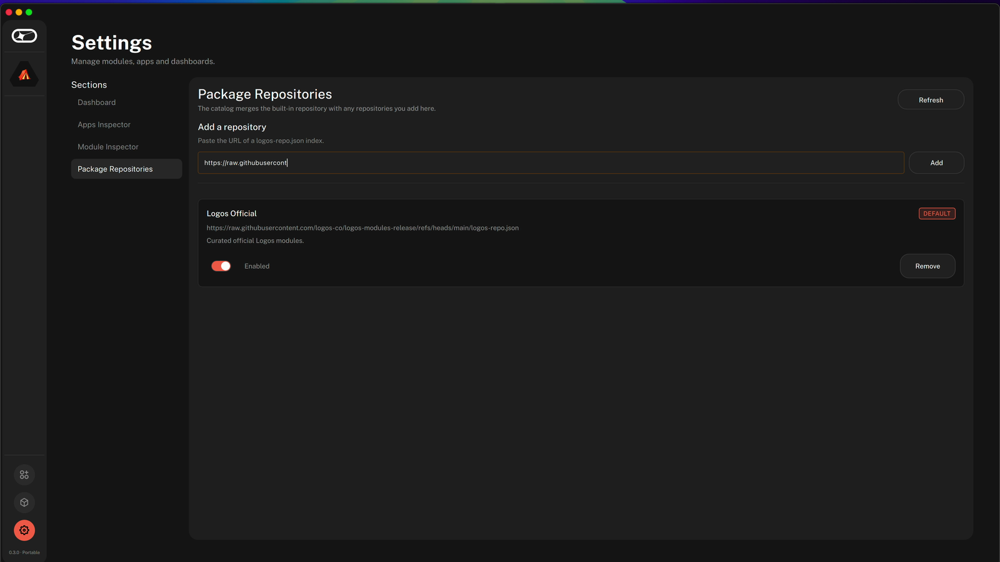

2. **Find the forum** in *Package Manager → Social*:

   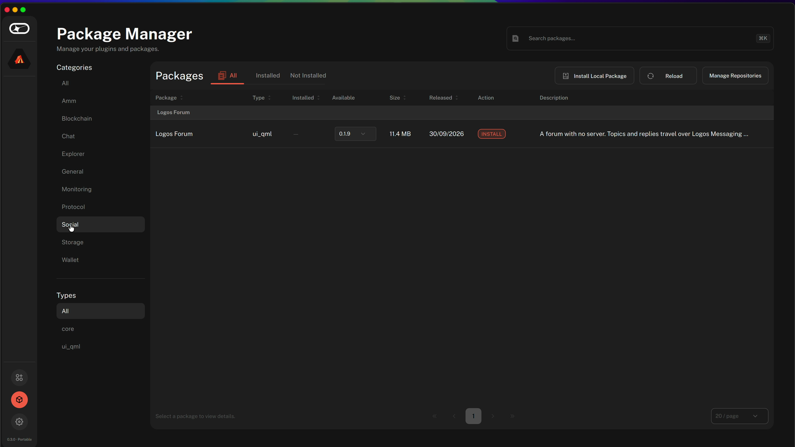

3. **Install.** Basecamp shows the two modules it brings in from the official catalog:

   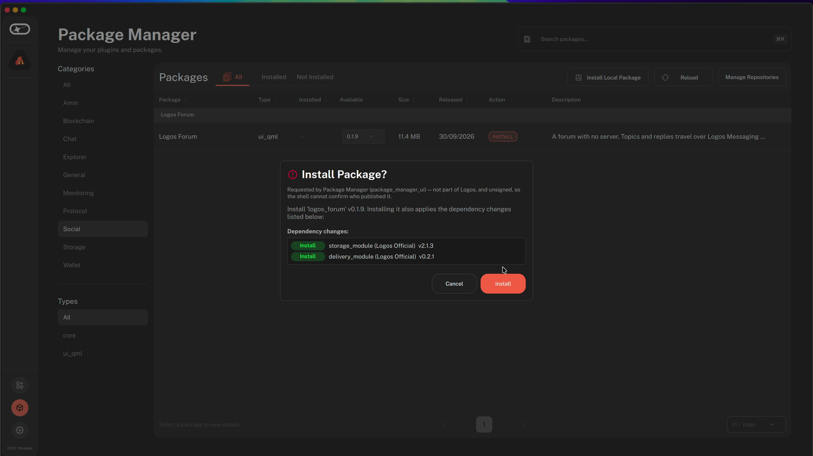

4. **Open it** from the sidebar. An account exists already, the history
   arrives from peers who are online, and within a few minutes the forum's
   sponsor has given this node its RLN membership (the banner says so while it
   happens). Posts written meanwhile wait in the outbox.

**From source**, on a clean machine (macOS or Linux, [Nix](https://nixos.org) and
[Basecamp 0.3.0](https://github.com/logos-co/logos-basecamp/releases/tag/0.3.0)):

```bash
git clone https://github.com/edenbd1/lp-0026-forum && cd lp-0026-forum
nix build .#lgx-portable                      # result/logos-logos_forum-module.lgx

# the modules it depends on, from the official Logos catalog
base=https://github.com/logos-co/logos-modules-release/releases/download
for m in delivery_module-v0.3.0/delivery_module-0.3.0 storage_module-v3.0.0/storage_module-3.0.0 \
         liblogos_rln_module-v0.10.0/liblogos_rln_module-0.10.0 liblogos_lez_rln_module-v4.2.1/liblogos_lez_rln_module-4.2.1 \
         libp2p_module-v1.1.0/libp2p_module-1.1.0; do curl -LO $base/$m.lgx; done
# and the sponsor's client, built from logos-rln-gifter with gifter/rln-gifter-module.patch
# (the CI artifact, or: git clone https://github.com/logos-co/logos-rln-gifter && cd logos-rln-gifter &&
#  git checkout c6d854a && git apply ../lp-0026-forum/gifter/rln-gifter-module.patch &&
#  nix build ./rust/rln-gifter-module#lgx-portable)

# install them all into a Basecamp user directory and open Basecamp on it
scripts/install-local.sh ~/basecamp-forum result/*.lgx *.lgx
LogosBasecamp --user-dir ~/basecamp-forum     # macOS: ~/Applications/LogosBasecamp.app/Contents/MacOS/LogosBasecamp
```

Then click *Logos Forum* in the sidebar.

## Deployment and addresses

There is nothing to deploy and no program address: the prize puts the
blockchain out of scope, and the forum runs no server. What plays that role:

| | |
|---|---|
| Module catalog | `https://raw.githubusercontent.com/edenbd1/logos-forum-catalog/main/logos-repo.json` |
| Network | Logos Delivery, `logos.dev` preset (cluster 3, no RLN) by default; `logos.test` (cluster 2, RLN) with `"network": "logos.test"` in `settings.json` or `LOGOS_FORUM_PRESET=logos.test` |
| RLN registry (logos.test) | `logos:testnet:841312e9…c893` (config account `9tZgjoUVHHWuE9D1cgQSXbYu2gm6uN9baTSERtTa9Str`) on the LEZ testnet zone behind `http://209.38.241.182:3240`, as delivery_module 0.3.0's preset names it |
| Membership sponsor | `/ip4/88.160.11.28/tcp/24026/p2p/16Uiu2HAm4XsEj65CPBnXZTZbniEE9SEiRtJUmngGuQxQoGFSHxA6`, paying from `2mDx4MEQkt3JE1ZxmM3W18Nnq8pEZBnJJzTbHpYw75wm` on that zone ([`gifter/`](gifter), `scripts/gifter-status.sh`); `"gifter"` in `settings.json` or `LOGOS_FORUM_GIFTER` names another, `"off"` turns it off |
| Forum topic | `/logos-forum/1/logos-forum-934410ad/json`, on shard `/waku/2/rs/2/6` |
| History | peers' bundles over Delivery; peers' snapshots on Logos Storage (same network) when opted in |
| Store nodes queried | the six fleet nodes of the preset (`delivery-01`, `delivery-02` in `do-ams3`, `gc-us-central1-a` and `ac-cn-hongkong-c` for `logos.dev`; `node-01`, `node-02` for `logos.test`) |
| Data on your machine | `<Basecamp user dir>/module_data/logos_forum/` (`forum.db`, `forum.log`) |

A separate forum can be run by starting Basecamp with `LOGOS_FORUM_NAME=<name>`;
the topic is derived from the name.

## logos.test, RLN and the sponsor

The forum runs on `logos.dev` by default. It can also run on `logos.test`, the
testnet v0.3 network (`"network": "logos.test"`, opt-in). There a
message goes out only with an RLN rate-limit proof, and a proof needs an RLN
membership in the network's registry, which costs native balance on the
registry's LEZ zone. Forum users do not need any: the forum's author runs a
**sponsor**, an open RLN gifter (LIP-158,
[`logos-rln-gifter`](https://github.com/logos-co/logos-rln-gifter)), and the
forum asks it for a membership by itself.

- On first launch the RLN module makes this node's RLN identity and keeps its
  secret; the forum sends only its public commitment to the sponsor, which
  registers it on the registry and pays (price 1,000,000 units plus the fee).
  The banner reads *Getting you a membership from the forum's sponsor…*, then
  *Registering the RLN membership*, then goes away once it is active
  (100 messages per 10-minute epoch, for 30 days; the forum asks again after).
- If the sponsor cannot be reached or cannot pay, the banner says why, the
  forum retries after 1, 3, 10 and then every 30 minutes, and *Try again now*
  asks at once.
- Reading, catching up and history never wait for it; posts stay in the
  outbox and go out once the membership is active. When the epoch's quota is
  spent, held posts are marked and go out in the next one.
- Tested from a fresh Basecamp through the sponsor and back
  ([`docs/e2e/e2e-sponsor-0.4.0-logos.test-unfunded.out`](docs/e2e/e2e-sponsor-0.4.0-logos.test-unfunded.out)):
  with its account still unfunded, the refusal reaches the banner in 15 s.

  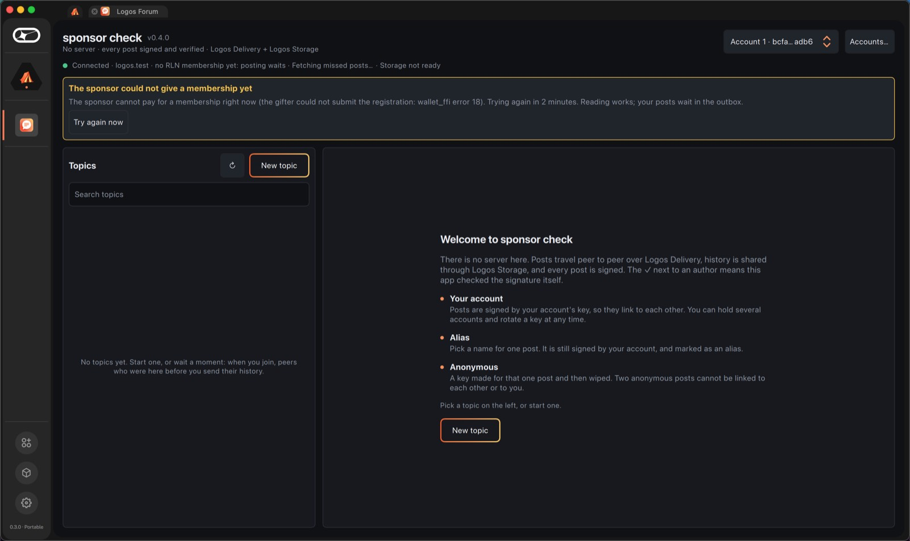
- What the sponsor sees and cannot see, and why it has no limits:
  [`docs/security.md`](docs/security.md#rln-and-the-forums-sponsor).

`logos.dev`, which runs no RLN, stays selectable: `"network": "logos.dev"` in
`<Basecamp user dir>/module_data/logos_forum/settings.json` (or
`LOGOS_FORUM_PRESET=logos.dev`, which wins), then restart Basecamp. With
`"gifter": "off"` the RLN module registers a membership itself once its own
LEZ account holds the price plus a fee reserve (182,800,000 units at today's
base fee); the banner then shows that account and the amount:

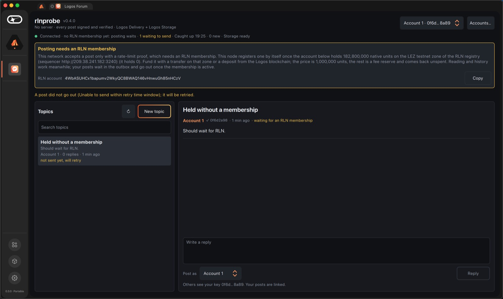

### Running the sponsor

The sponsor is a headless Logos runtime (`logosctl` 0.3.1) with
`liblogos_lez_rln_module` (its LEZ wallet pays), `libp2p_module` (a fixed key,
so its peer id never changes) and `rln_gifter_module` serving open, kept up on
a Mac by the LaunchAgent `co.logos.forum-gifter`, which also maps its port on
the router by UPnP ([`gifter/`](gifter)):

```bash
gifter/install.sh rln_gifter_module.lgx       # into ~/logos-forum-gifter, port 24026
scripts/gifter-status.sh                      # agent, port, mapping, address, payer, balance
```

Each membership costs the sponsor the price (1,000,000) and the fee (74M to
83M at base fee 8, as measured upstream on devnet; not yet measured on
logos.test), and its account must hold a fee reserve of about 181.8M at
the moment it registers, so it is funded with native units on the registry's
zone (`http://209.38.241.182:3240`), for instance by a deposit from the Logos
blockchain into that zone's channel.

## Walkthrough

Two real Basecamp nodes on logos.test, Alice on the left and Bob on the right,
with no server between them. Every screenshot comes from the demo film.

**A topic goes out and arrives, already verified.** Alice asks a question; a
moment later Bob has it, with a ✓ for the signature his own app checked.

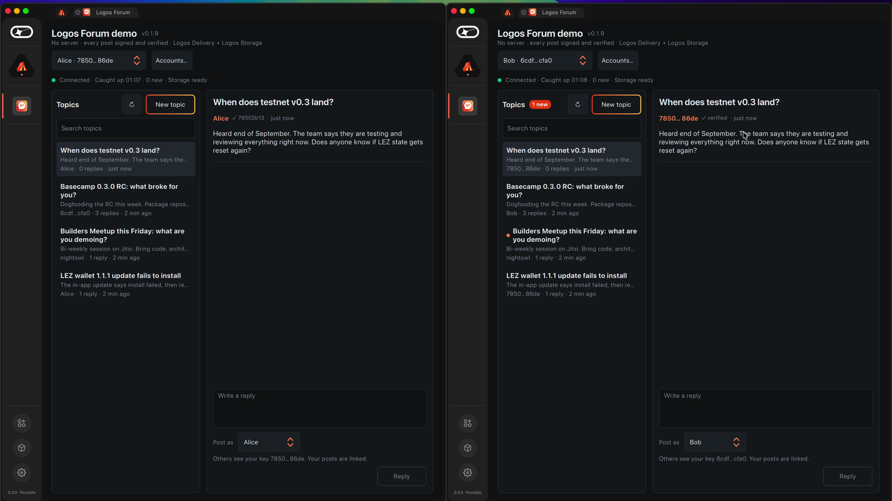

**Under an alias.** Bob answers as "Ghost". The name is his choice for this
post; the post is still signed by his key, and marked **alias** for everyone.

<p>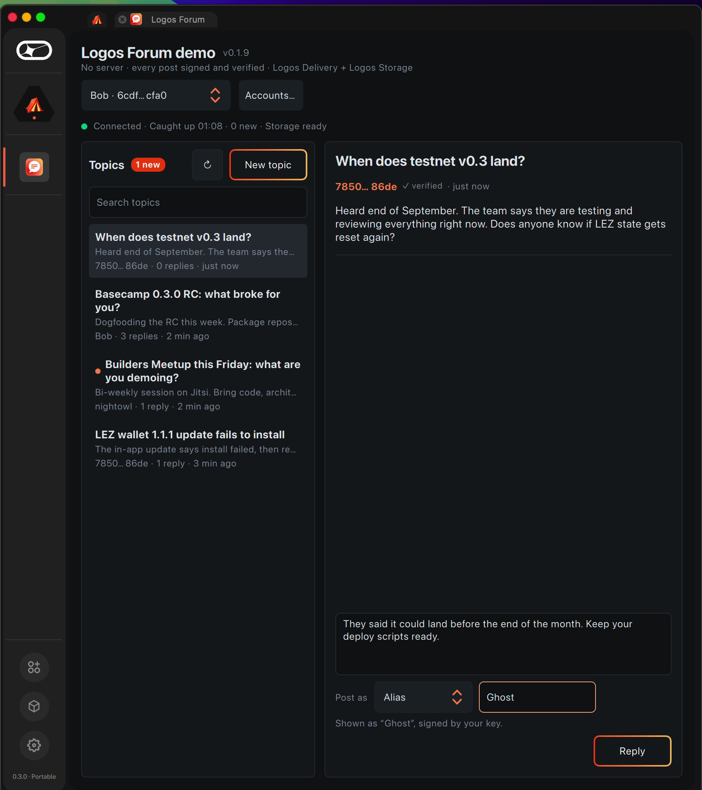 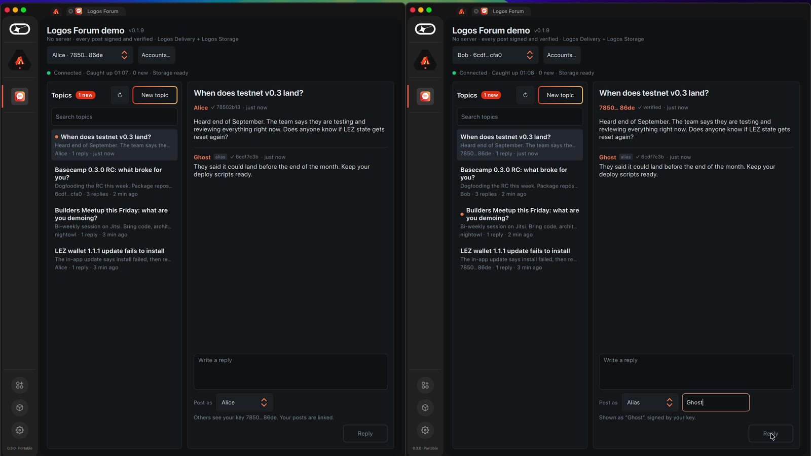</p>

**Anonymously.** Alice picks *Anonymous*: the app makes a key for that one
post, signs with it and wipes it. The explanation under the picker says what
the others will see.

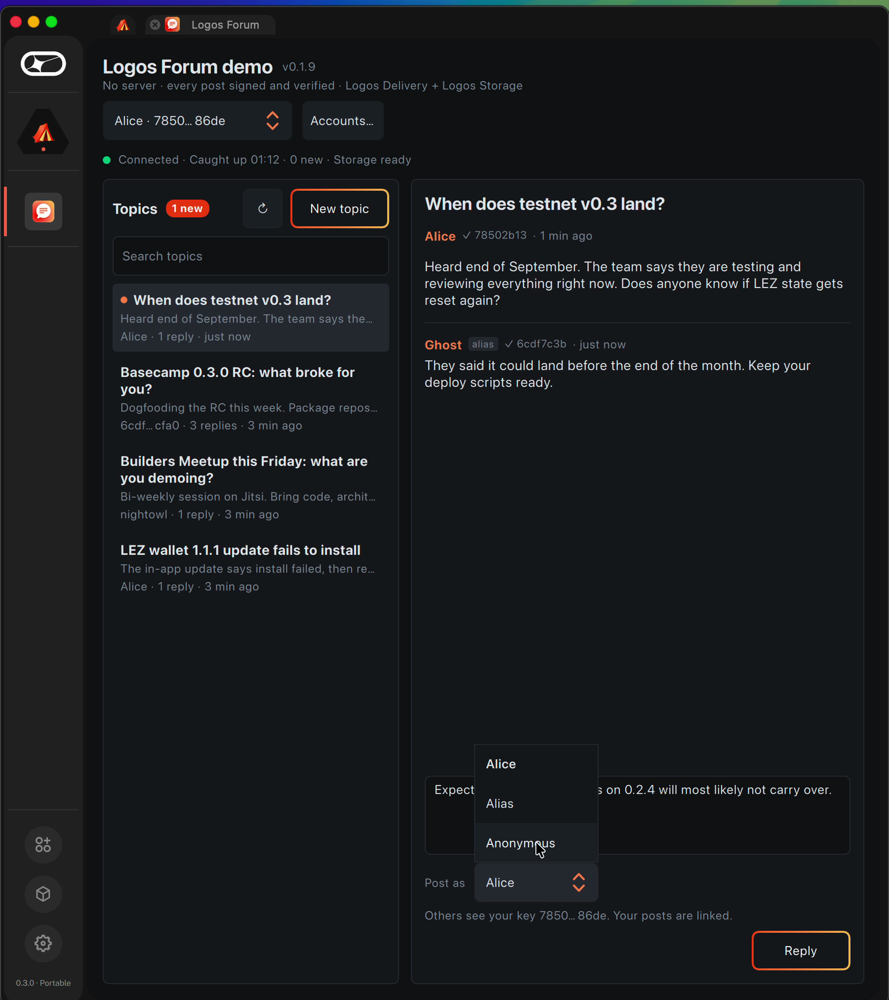

**Key rotation.** *Accounts… → Rotate now* gives the account a brand new key.
On Bob's side, Alice's posts before and after show two unrelated keys.

<p>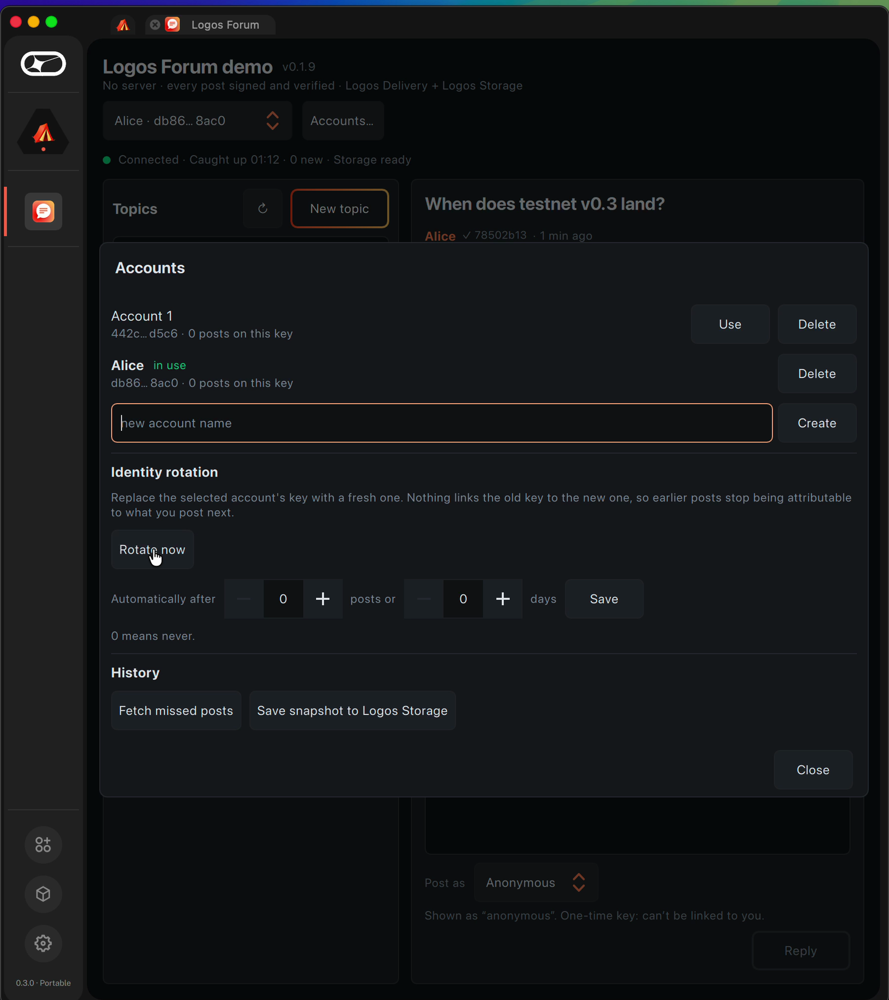 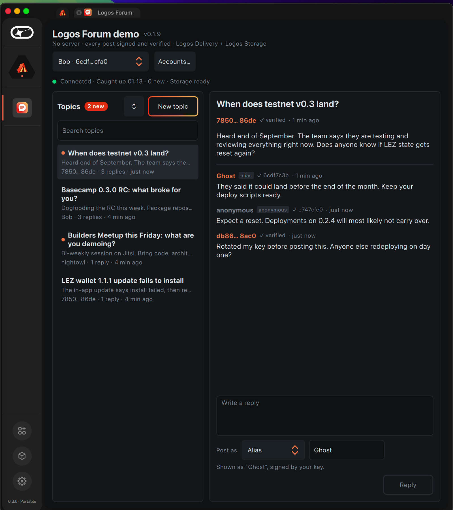</p>

**Offline.** Bob has no network. His reply is saved on his machine, marked
*sending…*, and the header counts *1 waiting to send*. When he is back online
it goes out on its own and Alice gets it.

<p>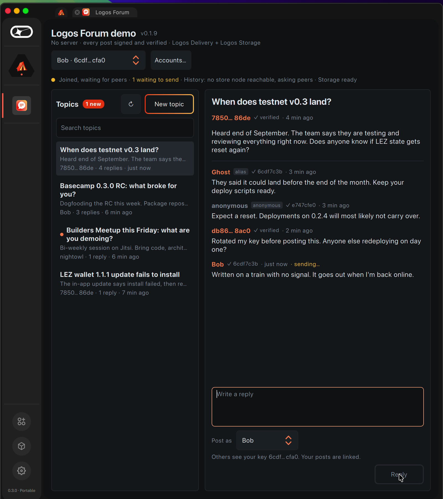 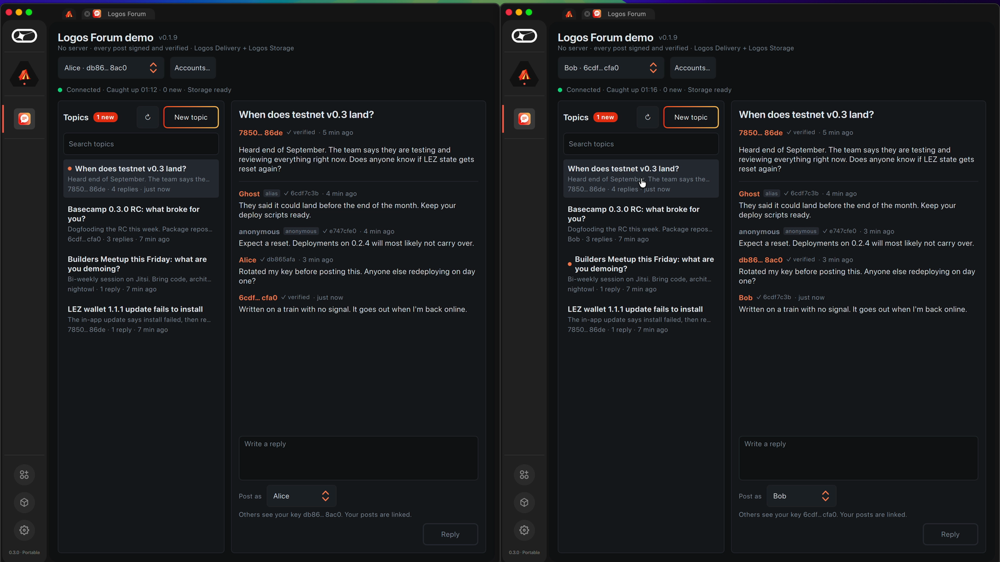</p>

**A newcomer gets the history.** A brand new install asks the peers already
there and receives every topic and every reply, each checked again on arrival
(*History from peers · 13 new*).

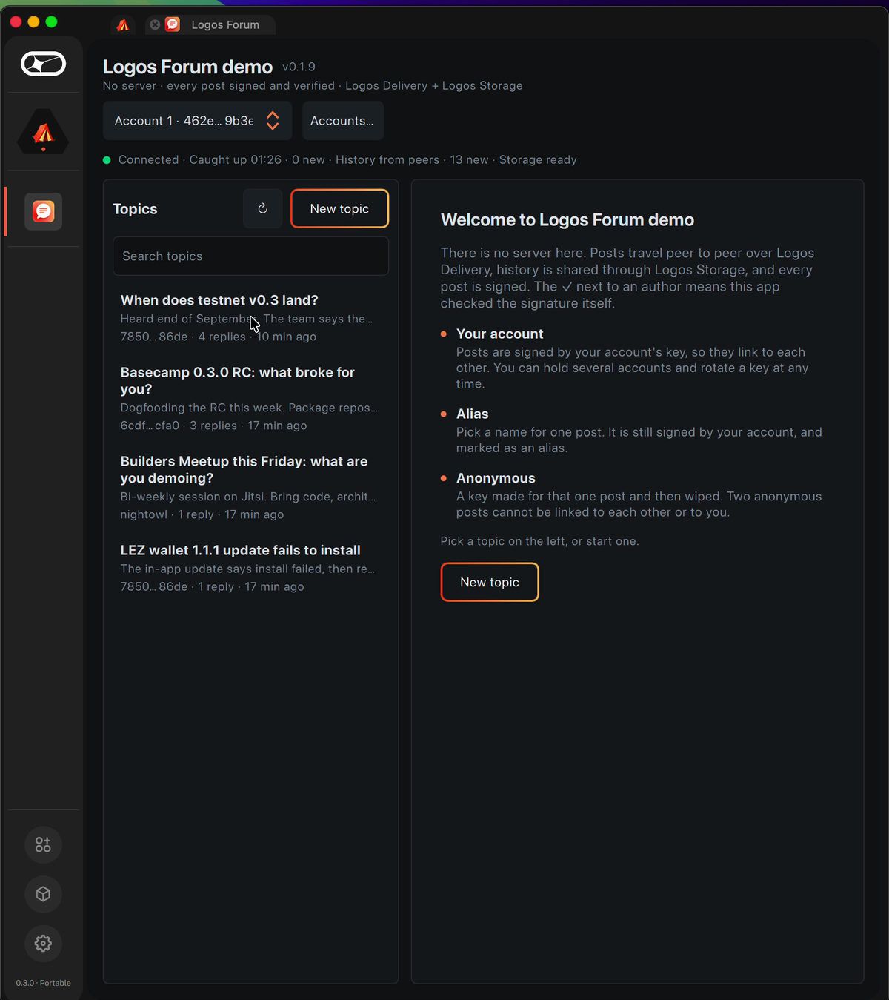

## Using the forum

**Your first minute.** Open *Logos Forum* in Basecamp's sidebar. An account
("Account 1") is created on first launch, so you can post straight away. The
header shows the network state (*Connected*, or *Joined, waiting for peers*)
and, under it, the history state: when the forum last caught up, and whether
Logos Storage is ready.

**Read.** The left column lists topics, most recently active first, with a
line of their text, their author and reply count; an orange dot marks activity
since you last opened a topic, and the search box filters by title, text or
author. Click one to open it; replies follow in order.
Every author line carries a ✓ and the first bytes of the key the post's
signature was checked against; hover it for the full key. A post whose
signature does not check is never shown.

**Post.** *New topic* opens the composer: a title, a body, and *Post as*.
Reply from the box under an open topic.

| Post as | What others see | What it links |
|---|---|---|
| *your account* | the account's key (or its label, on your own machine) | all posts by that account |
| *alias* | the name you type, marked **alias** | posts by the same account, to anyone comparing keys |
| *anonymous* | "anonymous", marked **anonymous**, under a key made for that post and wiped | nothing: two anonymous posts share no key |

**Accounts** (*Accounts…*): create several and switch between them; the one
selected signs what you post next. **Identity rotation** replaces the selected
account's key with a fresh one, now or automatically after a number of posts
or days. Nothing links the old key to the new one.

**Offline.** Write as usual: the post appears at once, marked *sending…*,
then *waiting for the network, will retry*, and the header counts what is
waiting. A post leaves that state only when the network confirms it has it:
Logos Delivery accepts a send even with no peers and retries it only in
memory, so the forum keeps the post itself and sends it again as soon as the
connection returns, or after two minutes without confirmation, or with
back-off (2 s … 5 min) after an error. This holds even after Basecamp was closed.
When you come back after
being away, the forum fetches what you missed from the network and from peers'
snapshots on Logos Storage; *Accounts… → Fetch missed posts* does it on demand,
and *Save snapshot to Logos Storage* publishes yours for others.

**Errors** are shown in one line under the header: a refused post (too long,
no title), a send the network gave up on (it is retried), a storage node that
is not ready.

## Any width, down to a phone

The view adapts instead of clipping. Below 720 px it shows one pane at a time
(the topic list, or the open topic with a way back), the header stacks, the
"Post as" explanation gets its own line, and long titles, keys and URLs wrap.
`scripts/responsive-shots.sh` renders the real view against a stand-in backend
(`tests/qml/Harness.qml`) in nine states at seven widths, from 360 px to 1600 px.

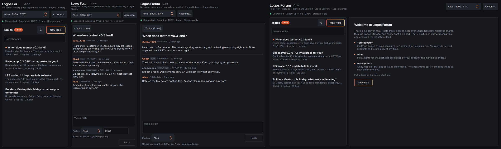

## Test between two real nodes

```bash
scripts/e2e-two-nodes.sh result/*.lgx delivery_module-0.3.0.lgx storage_module-3.0.0.lgx
```

The scripts run on the forum's default network, logos.test: pass the RLN
packages, `libp2p_module` and `rln_gifter_module` after the others, and each
posting node first waits for the membership the sponsor gives it
([`scripts/e2e-rln.sh`](scripts/e2e-rln.sh)): `E2E_RLN_HOME` keeps the nodes'
memberships between runs, `E2E_GIFTER_ACCOUNT` prints the sponsor's balance as
the run goes. `LOGOS_FORUM_PRESET=logos.dev` runs them without RLN.

Starts two Basecamp instances on logos.test, drives the forum's own interface
and checks each node's store: a topic from A reaches B with the same author
key; B's anonymous reply reaches A under a key none of B's accounts hold; and
B, wiped to a fresh install, recovers both posts from A's snapshot on Logos
Storage. Output of a run: [`docs/e2e/e2e-two-nodes.out`](docs/e2e/e2e-two-nodes.out).

## Build and test the core

Needs a C++20 compiler, CMake, libsodium, SQLite and nlohmann-json
(`brew install libsodium sqlite nlohmann-json` on macOS).

```bash
cmake -S core -B build -DCMAKE_BUILD_TYPE=Release
cmake --build build -j
./build/forum_core_tests
```

## Credits

The module wiring follows the reference
[`jzaki/forum-sample-app`](https://github.com/jzaki/forum-sample-app) that the
prize lists as a resource. The forum core here is written from scratch.

## Licence

MIT OR Apache-2.0.
