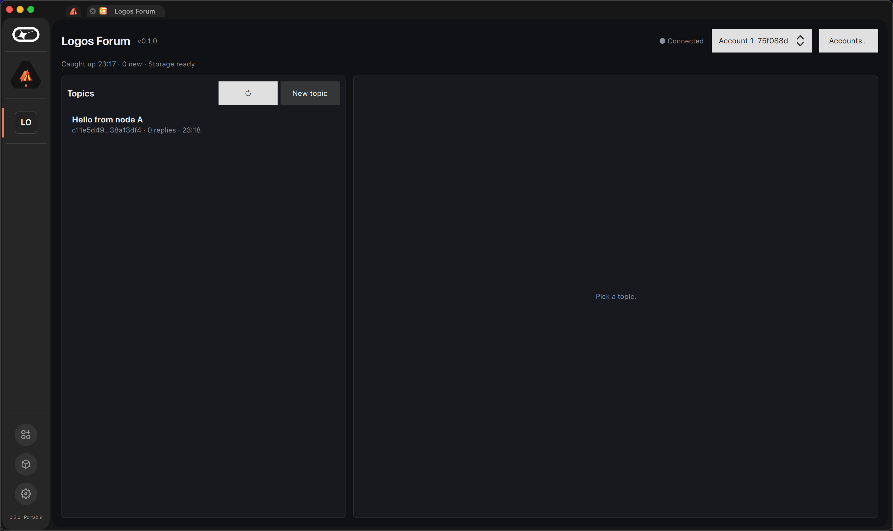
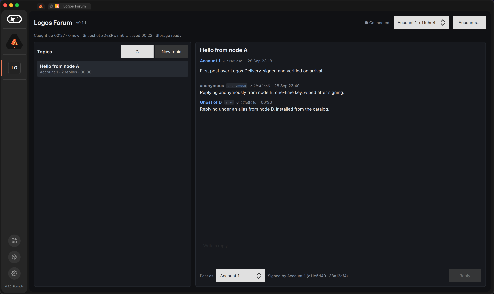
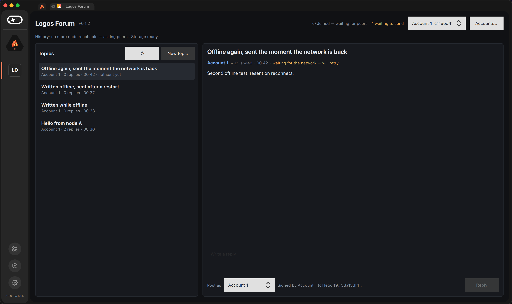
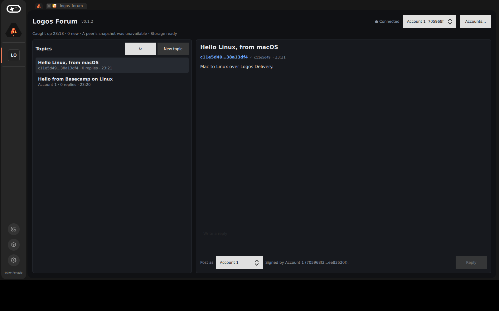
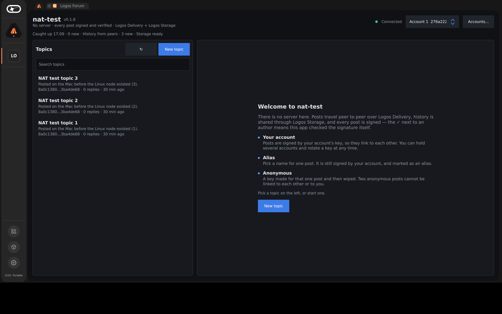
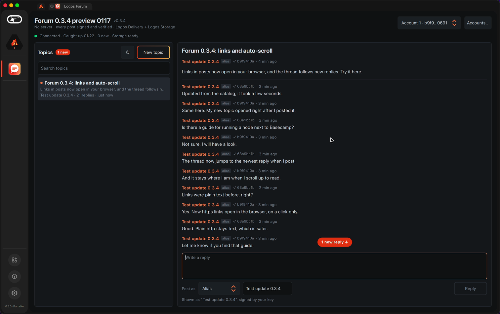
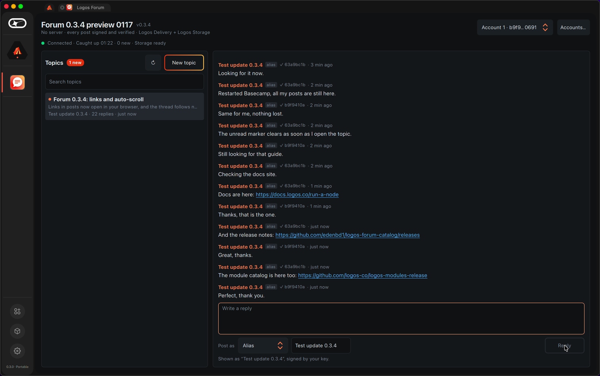
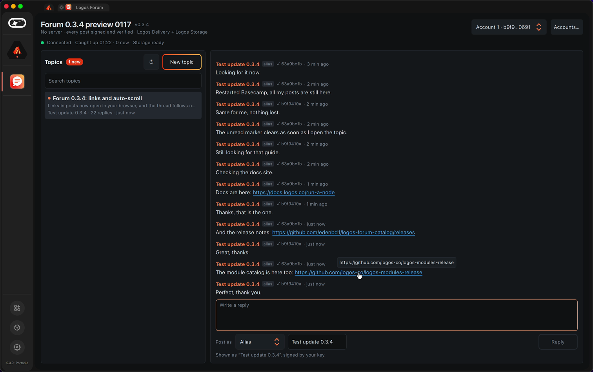

# End to end, between real nodes

## The full scenario: five nodes, 24 checks

[`scripts/e2e-full.sh`](../scripts/e2e-full.sh) runs five Basecamp nodes on
logos.test on a forum of its own, drives each through the forum's interface
and checks every node's store. Two consecutive runs, both 24/24: [run 1](e2e/e2e-full.run1.out), [run 2](e2e/e2e-full.run2.out).

| Who | What | Checked on the other nodes |
|---|---|---|
| A · Alice | a topic under her account | stored everywhere, with Alice's key |
| B · Bob | a reply under the alias "Ghost" | stored as *alias* "Ghost", signed by Bob's key |
| C | two anonymous replies | two different keys, neither is one of C's accounts |
| A · Alice2 | a second account, a new topic | a key unrelated to Alice's |
| A · rotation | Alice2 rotates, then replies | a new key, neither Alice's nor Alice2's old one |
| D · offline | posts with no network, closes, reopens online | nobody has it while D is offline; everyone has it after, and D's outbox empties |
| E · newcomer | a blank install joins at the end | holds exactly the same posts as A |

## Two nodes

Two Logos Basecamp 0.3.0 instances on one Mac (`--user-dir` keeps them apart),
each with `delivery_module` 0.2.1 and `storage_module` 2.1.2 from the official
catalog, joined to the public **logos.test** network. The forum is driven
through its own interface; every check reads the node's own SQLite store.
Script: [`scripts/e2e-two-nodes.sh`](../scripts/e2e-two-nodes.sh).

| Step | What is checked | Result |
|---|---|---|
| A posts a topic | B stores it; the author key is identical in both stores | ✓ (~1 s) |
| B replies anonymously | A stores it with mode *anonymous*, under a key none of B's accounts hold | ✓ |
| B is wiped and restarted | B recovers both posts from A's snapshot on Logos Storage | ✓ |
| D, installed **from the catalog** on a blank Basecamp, starts | D recovers the forum from A's snapshot (storage 2.1.3 ↔ 2.1.2) | ✓ |
| D replies under an alias | A stores it as *alias* "Ghost of D", signed by D's account key | ✓ |
| A, cut off from the network, posts; Basecamp is closed; A is reopened online | the post stays in A's outbox across the restart, is resent on reconnect, and D stores it | ✓ (23 s after relaunch) |





## What the network keeps

Before relying on the network's history, we measured it. A Store query to
each of four logos.test fleet nodes (`node-01.do-ams3`, `node-01.gc-us-central1-a`,
`node-01.ac-cn-hongkong-c`, `node-02.do-ams3`) returns `200 OK` and **no
messages**, whether we ask for the forum's content topic, for its whole shard
(`/waku/2/rs/2/6`), or with no filter at all. The fleet keeps no archive, so
a forum that depended on Store queries could never show a newcomer anything.

The forum still queries the store nodes (a network that archives will work
without change), and it also asks its peers. A node that comes online sends
`{"logos-forum-want":1, "have": <count>}` on the forum's topic. A peer holding
more posts saves a snapshot to Logos Storage and announces its CID, together
with its storage node's peer id and addresses. The newcomer dials that node
directly, downloads the snapshot, and merges it post by post. Every signature
is checked, so a snapshot carries no authority of its own. Snapshots are
content-addressed: two peers holding the same posts announce the same CID, and
it is fetched once. A peer answers at most every 30 seconds.

From the fresh node's log ([`e2e/node-b-fresh-install.log`](e2e/node-b-fresh-install.log)):

```
catch-up (reconnected): 0 messages, 0 new, peer …do-ams3 (0), …us-central1-a (0), …hongkong-c (0), …node-02.do-ams3 (0), status 200 OK
asked peers for history
dialing snapshot provider 16Uiu2HAkyNSyKrUi1q64jR1Xme1bzoEj722LiQWmnbAo7rVhiYpV
fetching snapshot zDvZRwzm8N45C9mv9f1Xi32Voh1deqBnrUuhu1ZbjjnQgwBqd5Xp
download done: {"sessionId":"zDvZ…Xp","success":true}, 422 bytes
snapshot imported: 1 new
```

## Offline, for real

Basecamp was started under `sandbox-exec` with outbound IP denied (local
sockets allowed, so its own processes still talk), which cuts one instance
off without touching the machine's network. The store query fails with
`PEER_DIAL_FAILURE`; `delivery_module` **accepts** the send and retries it in
memory ("No peers for topic"), reporting `messageError` after about a minute.
Our first version took acceptance as delivery and removed the post from its
outbox, so a post written offline would have been lost had Basecamp been closed
first. Now a post leaves the outbox only on `messagePropagated`/`messageSent`,
is resent when the connection returns, and survives the restart:



## Linux

The `linux-amd64` variant is built in CI (`ubuntu-24.04`, Nix) and merged with
the macOS one into the single package the catalog serves.

**It runs in the real Basecamp for Linux.** The official Basecamp 0.3.0
x86_64 AppImage, unpacked and started in an `ubuntu:24.04` amd64 container on
a virtual display ([`scripts/linux/`](../scripts/linux/)), with the forum and its
two dependencies installed from their `.lgx` packages. Opening the tile, the
forum starts its node, joins logos.test and is answered by the macOS nodes;
then, both ways:

| From | To | Result |
|---|---|---|
| Basecamp **Linux**: new topic | the two macOS nodes | stored by both, signed by the Linux node's key ✓ |
| Basecamp **macOS**: new topic | the Linux node | shown in its topic list ✓ |



Also checked in the same container: `dlopen(RTLD_NOW)` of the plugin and its
replica factory against the AppImage's own libraries (Qt 6.9.2) resolves every
dependency, and fails without them (`libQt6RemoteObjects.so.6: cannot open
shared object file`). That is the negative control.

**A limit this showed, and its fix.** The Linux node received snapshot
announcements from the macOS nodes but could not download them: the addresses
a macOS node announces for its storage node (loopback, LAN) are not reachable
from inside Docker's NAT, and the DHT did not find the content either. That is the
situation of two people at home behind their routers. Delivery, though, crosses
NAT. So when a snapshot cannot be fetched, the newcomer asks again with
`"via":"delivery"`, and a peer sends the posts themselves as bundles on the
forum's topic (under the network's 150 KiB message limit, newest first, each
post checked on arrival). Re-run with a blank Linux node behind the NAT and a
macOS node holding three posts ([log](e2e/node-linux-behind-nat.log)):

```
snapshot zDvZRwzm8h6re… unavailable: Failed to start chunk download.
snapshot unavailable: asked peers to send history over Delivery
received a history bundle: 3 new
```



The first attempt still failed, and it was ours: the macOS node had answered
the Storage request three seconds earlier, and a single "one answer every
30 s" limit silenced the fallback. Answers are now limited per path, and a core
test replays that exact sequence.

**One answer per newcomer.** Every peer that could answer a history request
waits a random 0–3 s and stands down if it sees another peer's answer to the
same request, so a newcomer costs the network one answer rather than one per
peer (a core test with five peers checks exactly one answer).

## Links and auto-scroll (0.3.4)

Two Basecamp 0.3.0 instances on one Mac, each with its own `--user-dir`, in a
forum of their own. Node A creates a topic (it opens at once), then posts
replies one after another: after each, the newest reply is the last thing in
view. A reply from node B arrives while A is at the bottom: A scrolls to it.
With A scrolled up to read, the next reply from B leaves A where it is and
shows a "1 new reply" pill; a click on it goes to the newest message.

An https link in a post is blue and underlined, the pointer turns into a hand
over it and a tooltip shows the URL. A local https server logged every
connection: none while the posts were shown and hovered, two (the browser's
TLS handshakes) at the moment of the click, which opened the system browser. A
plain `http://` URL in the same posts stays text.

History with everyone offline still passes on 0.3.4:
[e2e-history-offline-0.3.4.out](e2e/e2e-history-offline-0.3.4.out).





## Bugs this found

Running in the real host found three faults that no unit test could:

- A synchronous `storeQuery` blocked the backend; every module call that can
  take time is now asynchronous.
- A store node's last page carries `"paginationCursor": null`, and
  `json::value()` throws on a present-but-null key. An exception escaping a
  module callback aborts the ui-host process, so every read of network or
  module JSON is now typed and non-throwing, including in the core, which
  gained a test that feeds it mistyped traffic.
- A synchronous storage call made while storage_module was dispatching its
  own event waited out the 20 s RPC timeout; storage calls are asynchronous too.

Also avoided by design: no `QRegularExpression` anywhere (under Basecamp's
hardened runtime it JIT-compiles and traps), and the storage node listens on a
per-install random port, since the default discovery port is fixed and two
instances on one machine would collide.
